# Design system — full specification

> Generated by `design-system/scripts/build.mjs` from Figma variables (structure: AlignUI Design System 2.0). Do not edit by hand — change the Figma variables (or `tokens/figma.raw.json`) and rebuild. Last built 2026-07-14.

## How to use this file (read this first, especially if you are an AI agent)

This file is the complete contract of the Design system. When building any UI in this repository:

1. **Never hardcode a color, radius, spacing, shadow, or font value.** Every visual value must come from a token below, consumed as a CSS variable (`var(--color-bg-white-0)`) or a Tailwind theme key (`bg-bg-white-0`, from `design-system/tokens/tailwind.theme.js`).
2. **Use semantic color tokens** (`color/bg/*`, `color/text/*`, `color/icon/*`, `color/stroke/*`, `color/state/*`, `color/primary/*`) in product UI. Primitive scales (`color/blue/500`, …) exist to define semantics — do not use them directly in components.
3. **Check the component catalog below before writing a new component.** If the component exists and is code-connected, import it from the listed path. If it exists but is not built yet, scaffold it from its spec (props, states, tokens) rather than inventing your own API.
4. **Dark mode is automatic** when you use the tokens: `variables.css` swaps values under `[data-theme="dark"]` / `prefers-color-scheme`. Never write `dark:`-style one-off colors that bypass tokens.
5. **State colors map to intent**, not to hue: success=green, error=red, warning=orange, information=blue, away=yellow, feature=purple, verified=sky, highlighted=pink, stable=teal, faded=gray. Pick by meaning.
6. After generating UI code, run `node design-system/scripts/lint.mjs --code <dir>` to verify nothing drifted from the tokens.

**Consumption artifacts** (regenerate with `node design-system/scripts/build.mjs`):

| Artifact | Use |
|---|---|
| `design-system/tokens/variables.css` | Import once, globally. Defines every CSS variable, light + dark. |
| `design-system/tokens/tailwind.theme.js` | `theme: { extend: require("./design-system/tokens/tailwind.theme.js") }` |
| `design-system/tokens/tokens.json` | DTCG-style JSON, for any other toolchain. |
| `design-system/site/` | Human-readable docs site of the same content. |

Naming convention: token `color/bg/white-0` → CSS `var(--color-bg-white-0)` → Tailwind `colors["bg-white-0"]` (class `bg-bg-white-0`, `text-text-strong-950`, `border-stroke-soft-200`, …).

## Color — semantic tokens (use these in UI)

### color/bg

Backgrounds, from page canvas (`white-0`) to inverted surfaces (`strong-950`).

| Token | CSS variable | Light | Dark |
|---|---|---|---|
| `color/bg/white-0` | `var(--color-bg-white-0)` | `#ffffff` | `#171717` |
| `color/bg/weak-50` | `var(--color-bg-weak-50)` | `#f7f7f7` | `#1c1c1c` |
| `color/bg/soft-200` | `var(--color-bg-soft-200)` | `#ebebeb` | `#333333` |
| `color/bg/sub-300` | `var(--color-bg-sub-300)` | `#d1d1d1` | `#5c5c5c` |
| `color/bg/surface-800` | `var(--color-bg-surface-800)` | `#262626` | `#ebebeb` |
| `color/bg/strong-950` | `var(--color-bg-strong-950)` | `#171717` | `#ffffff` |

### color/text

Text colors by emphasis: strong → sub → soft → disabled.

| Token | CSS variable | Light | Dark |
|---|---|---|---|
| `color/text/strong-950` | `var(--color-text-strong-950)` | `#171717` | `#ffffff` |
| `color/text/sub-600` | `var(--color-text-sub-600)` | `#5c5c5c` | `#a3a3a3` |
| `color/text/soft-400` | `var(--color-text-soft-400)` | `#a3a3a3` | `#7b7b7b` |
| `color/text/disabled-300` | `var(--color-text-disabled-300)` | `#d1d1d1` | `#5c5c5c` |
| `color/text/white-0` | `var(--color-text-white-0)` | `#ffffff` | `#171717` |

### color/icon

Icon colors, same emphasis ladder as text.

| Token | CSS variable | Light | Dark |
|---|---|---|---|
| `color/icon/strong-950` | `var(--color-icon-strong-950)` | `#171717` | `#ffffff` |
| `color/icon/sub-600` | `var(--color-icon-sub-600)` | `#5c5c5c` | `#a3a3a3` |
| `color/icon/soft-400` | `var(--color-icon-soft-400)` | `#a3a3a3` | `#7b7b7b` |
| `color/icon/disabled-300` | `var(--color-icon-disabled-300)` | `#d1d1d1` | `#5c5c5c` |
| `color/icon/white-0` | `var(--color-icon-white-0)` | `#ffffff` | `#171717` |

### color/stroke

Borders and dividers.

| Token | CSS variable | Light | Dark |
|---|---|---|---|
| `color/stroke/strong-950` | `var(--color-stroke-strong-950)` | `#171717` | `#ffffff` |
| `color/stroke/sub-300` | `var(--color-stroke-sub-300)` | `#d1d1d1` | `#5c5c5c` |
| `color/stroke/soft-200` | `var(--color-stroke-soft-200)` | `#ebebeb` | `#333333` |
| `color/stroke/white-0` | `var(--color-stroke-white-0)` | `#ffffff` | `#171717` |

### color/primary

The brand/action color. Rebrand a project by repointing these (and the alpha primitives) — nothing else changes.

| Token | CSS variable | Light | Dark |
|---|---|---|---|
| `color/primary/base` | `var(--color-primary-base)` | `#335cff` | `#335cff` |
| `color/primary/dark` | `var(--color-primary-dark)` | `#2547d0` | `#2547d0` |
| `color/primary/darker` | `var(--color-primary-darker)` | `#1f3bad` | `#1f3bad` |
| `color/primary/alpha-10` | `var(--color-primary-alpha-10)` | `#476cff1a` | `#476cff1a` |
| `color/primary/alpha-16` | `var(--color-primary-alpha-16)` | `#476cff29` | `#476cff29` |
| `color/primary/alpha-24` | `var(--color-primary-alpha-24)` | `#476cff3d` | `#476cff3d` |

### color/state

Intent colors. Per state: `lighter` (tinted bg), `light` (borders/accents on tint), `base` (the color), `dark` (text on tint).

| Token | CSS variable | Light | Dark |
|---|---|---|---|
| `color/state/faded/lighter` | `var(--color-state-faded-lighter)` | `#f5f5f5` | `#171717` |
| `color/state/faded/light` | `var(--color-state-faded-light)` | `#ebebeb` | `#262626` |
| `color/state/faded/base` | `var(--color-state-faded-base)` | `#7b7b7b` | `#7b7b7b` |
| `color/state/faded/dark` | `var(--color-state-faded-dark)` | `#171717` | `#ebebeb` |
| `color/state/information/lighter` | `var(--color-state-information-lighter)` | `#ebf1ff` | `#122368` |
| `color/state/information/light` | `var(--color-state-information-light)` | `#c0d5ff` | `#1f3bad` |
| `color/state/information/base` | `var(--color-state-information-base)` | `#335cff` | `#335cff` |
| `color/state/information/dark` | `var(--color-state-information-dark)` | `#122368` | `#c0d5ff` |
| `color/state/warning/lighter` | `var(--color-state-warning-lighter)` | `#fff3eb` | `#71330a` |
| `color/state/warning/light` | `var(--color-state-warning-light)` | `#ffd9c0` | `#b75310` |
| `color/state/warning/base` | `var(--color-state-warning-base)` | `#fa7319` | `#fa7319` |
| `color/state/warning/dark` | `var(--color-state-warning-dark)` | `#71330a` | `#ffd9c0` |
| `color/state/error/lighter` | `var(--color-state-error-lighter)` | `#ffebec` | `#681219` |
| `color/state/error/light` | `var(--color-state-error-light)` | `#ffc0c5` | `#ad1f2b` |
| `color/state/error/base` | `var(--color-state-error-base)` | `#fb3748` | `#fb3748` |
| `color/state/error/dark` | `var(--color-state-error-dark)` | `#681219` | `#ffc0c5` |
| `color/state/success/lighter` | `var(--color-state-success-lighter)` | `#e3f7ec` | `#0b4627` |
| `color/state/success/light` | `var(--color-state-success-light)` | `#c2f5da` | `#1a7544` |
| `color/state/success/base` | `var(--color-state-success-base)` | `#1fc16b` | `#1fc16b` |
| `color/state/success/dark` | `var(--color-state-success-dark)` | `#0b4627` | `#c2f5da` |
| `color/state/away/lighter` | `var(--color-state-away-lighter)` | `#fffaeb` | `#624c18` |
| `color/state/away/light` | `var(--color-state-away-light)` | `#ffecc0` | `#a78025` |
| `color/state/away/base` | `var(--color-state-away-base)` | `#f6b51e` | `#f6b51e` |
| `color/state/away/dark` | `var(--color-state-away-dark)` | `#624c18` | `#ffecc0` |
| `color/state/feature/lighter` | `var(--color-state-feature-lighter)` | `#efebff` | `#351a75` |
| `color/state/feature/light` | `var(--color-state-feature-light)` | `#cac0ff` | `#4c25a7` |
| `color/state/feature/base` | `var(--color-state-feature-base)` | `#7d52f4` | `#7d52f4` |
| `color/state/feature/dark` | `var(--color-state-feature-dark)` | `#351a75` | `#cac0ff` |
| `color/state/verified/lighter` | `var(--color-state-verified-lighter)` | `#ebf8ff` | `#124b68` |
| `color/state/verified/light` | `var(--color-state-verified-light)` | `#c0eaff` | `#1f7ead` |
| `color/state/verified/base` | `var(--color-state-verified-base)` | `#47c2ff` | `#47c2ff` |
| `color/state/verified/dark` | `var(--color-state-verified-dark)` | `#124b68` | `#c0eaff` |
| `color/state/highlighted/lighter` | `var(--color-state-highlighted-lighter)` | `#ffebf4` | `#68123d` |
| `color/state/highlighted/light` | `var(--color-state-highlighted-light)` | `#ffc0df` | `#ad1f66` |
| `color/state/highlighted/base` | `var(--color-state-highlighted-base)` | `#fb4ba3` | `#fb4ba3` |
| `color/state/highlighted/dark` | `var(--color-state-highlighted-dark)` | `#68123d` | `#ffc0df` |
| `color/state/stable/lighter` | `var(--color-state-stable-lighter)` | `#e4fbf8` | `#0b463e` |
| `color/state/stable/light` | `var(--color-state-stable-light)` | `#c2f5ee` | `#1a7569` |
| `color/state/stable/base` | `var(--color-state-stable-base)` | `#22d3bb` | `#22d3bb` |
| `color/state/stable/dark` | `var(--color-state-stable-dark)` | `#0b463e` | `#c2f5ee` |

### color/static

Never flip in dark mode.

| Token | CSS variable | Light | Dark |
|---|---|---|---|
| `color/static/black` | `var(--color-static-black)` | `#171717` | `#171717` |
| `color/static/white` | `var(--color-static-white)` | `#ffffff` | `#ffffff` |

## Color — primitive scales (define semantics only; do not use directly)

### color/gray

| Token | CSS variable | Value |
|---|---|---|
| `color/gray/0` | `var(--color-gray-0)` | `#ffffff` |
| `color/gray/50` | `var(--color-gray-50)` | `#f7f7f7` |
| `color/gray/100` | `var(--color-gray-100)` | `#f5f5f5` |
| `color/gray/200` | `var(--color-gray-200)` | `#ebebeb` |
| `color/gray/300` | `var(--color-gray-300)` | `#d1d1d1` |
| `color/gray/400` | `var(--color-gray-400)` | `#a3a3a3` |
| `color/gray/500` | `var(--color-gray-500)` | `#7b7b7b` |
| `color/gray/600` | `var(--color-gray-600)` | `#5c5c5c` |
| `color/gray/700` | `var(--color-gray-700)` | `#333333` |
| `color/gray/800` | `var(--color-gray-800)` | `#262626` |
| `color/gray/900` | `var(--color-gray-900)` | `#1c1c1c` |
| `color/gray/950` | `var(--color-gray-950)` | `#171717` |

### color/slate

| Token | CSS variable | Value |
|---|---|---|
| `color/slate/0` | `var(--color-slate-0)` | `#ffffff` |
| `color/slate/50` | `var(--color-slate-50)` | `#f5f7fa` |
| `color/slate/100` | `var(--color-slate-100)` | `#f2f5f8` |
| `color/slate/200` | `var(--color-slate-200)` | `#eaecf0` |
| `color/slate/300` | `var(--color-slate-300)` | `#cacfd8` |
| `color/slate/400` | `var(--color-slate-400)` | `#99a0ae` |
| `color/slate/500` | `var(--color-slate-500)` | `#717784` |
| `color/slate/600` | `var(--color-slate-600)` | `#525866` |
| `color/slate/700` | `var(--color-slate-700)` | `#2b303b` |
| `color/slate/800` | `var(--color-slate-800)` | `#222530` |
| `color/slate/900` | `var(--color-slate-900)` | `#181b25` |
| `color/slate/950` | `var(--color-slate-950)` | `#0e121b` |

### color/blue

| Token | CSS variable | Value |
|---|---|---|
| `color/blue/50` | `var(--color-blue-50)` | `#ebf1ff` |
| `color/blue/100` | `var(--color-blue-100)` | `#d5e2ff` |
| `color/blue/200` | `var(--color-blue-200)` | `#c0d5ff` |
| `color/blue/300` | `var(--color-blue-300)` | `#97baff` |
| `color/blue/400` | `var(--color-blue-400)` | `#4d82ff` |
| `color/blue/500` | `var(--color-blue-500)` | `#335cff` |
| `color/blue/600` | `var(--color-blue-600)` | `#3559e9` |
| `color/blue/700` | `var(--color-blue-700)` | `#2547d0` |
| `color/blue/800` | `var(--color-blue-800)` | `#1f3bad` |
| `color/blue/900` | `var(--color-blue-900)` | `#182f8b` |
| `color/blue/950` | `var(--color-blue-950)` | `#122368` |

### color/orange

| Token | CSS variable | Value |
|---|---|---|
| `color/orange/50` | `var(--color-orange-50)` | `#fff3eb` |
| `color/orange/100` | `var(--color-orange-100)` | `#ffe6d5` |
| `color/orange/200` | `var(--color-orange-200)` | `#ffd9c0` |
| `color/orange/300` | `var(--color-orange-300)` | `#ffc197` |
| `color/orange/400` | `var(--color-orange-400)` | `#ffa468` |
| `color/orange/500` | `var(--color-orange-500)` | `#fa7319` |
| `color/orange/600` | `var(--color-orange-600)` | `#e16614` |
| `color/orange/700` | `var(--color-orange-700)` | `#ce5e12` |
| `color/orange/800` | `var(--color-orange-800)` | `#b75310` |
| `color/orange/900` | `var(--color-orange-900)` | `#96440d` |
| `color/orange/950` | `var(--color-orange-950)` | `#71330a` |

### color/red

| Token | CSS variable | Value |
|---|---|---|
| `color/red/50` | `var(--color-red-50)` | `#ffebec` |
| `color/red/100` | `var(--color-red-100)` | `#ffd5d8` |
| `color/red/200` | `var(--color-red-200)` | `#ffc0c5` |
| `color/red/300` | `var(--color-red-300)` | `#ff97a0` |
| `color/red/400` | `var(--color-red-400)` | `#ff6875` |
| `color/red/500` | `var(--color-red-500)` | `#fb3748` |
| `color/red/600` | `var(--color-red-600)` | `#e93544` |
| `color/red/700` | `var(--color-red-700)` | `#d02533` |
| `color/red/800` | `var(--color-red-800)` | `#ad1f2b` |
| `color/red/900` | `var(--color-red-900)` | `#8b1822` |
| `color/red/950` | `var(--color-red-950)` | `#681219` |

### color/green

| Token | CSS variable | Value |
|---|---|---|
| `color/green/50` | `var(--color-green-50)` | `#e3f7ec` |
| `color/green/100` | `var(--color-green-100)` | `#d6f5e8` |
| `color/green/200` | `var(--color-green-200)` | `#c2f5da` |
| `color/green/300` | `var(--color-green-300)` | `#84ebb4` |
| `color/green/400` | `var(--color-green-400)` | `#3ee089` |
| `color/green/500` | `var(--color-green-500)` | `#1fc16b` |
| `color/green/600` | `var(--color-green-600)` | `#1daf61` |
| `color/green/700` | `var(--color-green-700)` | `#178c4e` |
| `color/green/800` | `var(--color-green-800)` | `#1a7544` |
| `color/green/900` | `var(--color-green-900)` | `#16643b` |
| `color/green/950` | `var(--color-green-950)` | `#0b4627` |

### color/yellow

| Token | CSS variable | Value |
|---|---|---|
| `color/yellow/50` | `var(--color-yellow-50)` | `#fffaeb` |
| `color/yellow/100` | `var(--color-yellow-100)` | `#ffefcc` |
| `color/yellow/200` | `var(--color-yellow-200)` | `#ffecc0` |
| `color/yellow/300` | `var(--color-yellow-300)` | `#ffe097` |
| `color/yellow/400` | `var(--color-yellow-400)` | `#ffd268` |
| `color/yellow/500` | `var(--color-yellow-500)` | `#f6b51e` |
| `color/yellow/600` | `var(--color-yellow-600)` | `#e6a819` |
| `color/yellow/700` | `var(--color-yellow-700)` | `#c99a2c` |
| `color/yellow/800` | `var(--color-yellow-800)` | `#a78025` |
| `color/yellow/900` | `var(--color-yellow-900)` | `#86661d` |
| `color/yellow/950` | `var(--color-yellow-950)` | `#624c18` |

### color/purple

| Token | CSS variable | Value |
|---|---|---|
| `color/purple/50` | `var(--color-purple-50)` | `#efebff` |
| `color/purple/100` | `var(--color-purple-100)` | `#dcd5ff` |
| `color/purple/200` | `var(--color-purple-200)` | `#cac0ff` |
| `color/purple/300` | `var(--color-purple-300)` | `#a897ff` |
| `color/purple/400` | `var(--color-purple-400)` | `#8c71f6` |
| `color/purple/500` | `var(--color-purple-500)` | `#7d52f4` |
| `color/purple/600` | `var(--color-purple-600)` | `#693ee0` |
| `color/purple/700` | `var(--color-purple-700)` | `#5b2cc9` |
| `color/purple/800` | `var(--color-purple-800)` | `#4c25a7` |
| `color/purple/900` | `var(--color-purple-900)` | `#3d1d86` |
| `color/purple/950` | `var(--color-purple-950)` | `#351a75` |

### color/sky

| Token | CSS variable | Value |
|---|---|---|
| `color/sky/50` | `var(--color-sky-50)` | `#ebf8ff` |
| `color/sky/100` | `var(--color-sky-100)` | `#d5f1ff` |
| `color/sky/200` | `var(--color-sky-200)` | `#c0eaff` |
| `color/sky/300` | `var(--color-sky-300)` | `#97dcff` |
| `color/sky/400` | `var(--color-sky-400)` | `#68cdff` |
| `color/sky/500` | `var(--color-sky-500)` | `#47c2ff` |
| `color/sky/600` | `var(--color-sky-600)` | `#35ade9` |
| `color/sky/700` | `var(--color-sky-700)` | `#2597d0` |
| `color/sky/800` | `var(--color-sky-800)` | `#1f7ead` |
| `color/sky/900` | `var(--color-sky-900)` | `#18658b` |
| `color/sky/950` | `var(--color-sky-950)` | `#124b68` |

### color/pink

| Token | CSS variable | Value |
|---|---|---|
| `color/pink/50` | `var(--color-pink-50)` | `#ffebf4` |
| `color/pink/100` | `var(--color-pink-100)` | `#ffd5ea` |
| `color/pink/200` | `var(--color-pink-200)` | `#ffc0df` |
| `color/pink/300` | `var(--color-pink-300)` | `#ff97cb` |
| `color/pink/400` | `var(--color-pink-400)` | `#ff68b3` |
| `color/pink/500` | `var(--color-pink-500)` | `#fb4ba3` |
| `color/pink/600` | `var(--color-pink-600)` | `#e9358f` |
| `color/pink/700` | `var(--color-pink-700)` | `#d0257a` |
| `color/pink/800` | `var(--color-pink-800)` | `#ad1f66` |
| `color/pink/900` | `var(--color-pink-900)` | `#8b1852` |
| `color/pink/950` | `var(--color-pink-950)` | `#68123d` |

### color/teal

| Token | CSS variable | Value |
|---|---|---|
| `color/teal/50` | `var(--color-teal-50)` | `#e4fbf8` |
| `color/teal/100` | `var(--color-teal-100)` | `#d0fbf5` |
| `color/teal/200` | `var(--color-teal-200)` | `#c2f5ee` |
| `color/teal/300` | `var(--color-teal-300)` | `#84ebdd` |
| `color/teal/400` | `var(--color-teal-400)` | `#3fdec9` |
| `color/teal/500` | `var(--color-teal-500)` | `#22d3bb` |
| `color/teal/600` | `var(--color-teal-600)` | `#1daf9c` |
| `color/teal/700` | `var(--color-teal-700)` | `#178c7d` |
| `color/teal/800` | `var(--color-teal-800)` | `#1a7569` |
| `color/teal/900` | `var(--color-teal-900)` | `#16645a` |
| `color/teal/950` | `var(--color-teal-950)` | `#0b463e` |

### color/alpha

| Token | CSS variable | Value |
|---|---|---|
| `color/alpha/white-10` | `var(--color-alpha-white-10)` | `#ffffff1a` |
| `color/alpha/white-16` | `var(--color-alpha-white-16)` | `#ffffff29` |
| `color/alpha/white-24` | `var(--color-alpha-white-24)` | `#ffffff3d` |
| `color/alpha/black-10` | `var(--color-alpha-black-10)` | `#1717171a` |
| `color/alpha/black-16` | `var(--color-alpha-black-16)` | `#17171729` |
| `color/alpha/black-24` | `var(--color-alpha-black-24)` | `#1717173d` |
| `color/alpha/primary-10` | `var(--color-alpha-primary-10)` | `#476cff1a` |
| `color/alpha/primary-16` | `var(--color-alpha-primary-16)` | `#476cff29` |
| `color/alpha/primary-24` | `var(--color-alpha-primary-24)` | `#476cff3d` |

## Radius

Pixel radii. `radius/full` is a pill/circle.

| Token | CSS variable | Value |
|---|---|---|
| `radius/4` | `var(--radius-4)` | `4px` |
| `radius/6` | `var(--radius-6)` | `6px` |
| `radius/8` | `var(--radius-8)` | `8px` |
| `radius/10` | `var(--radius-10)` | `10px` |
| `radius/12` | `var(--radius-12)` | `12px` |
| `radius/16` | `var(--radius-16)` | `16px` |
| `radius/20` | `var(--radius-20)` | `20px` |
| `radius/24` | `var(--radius-24)` | `24px` |
| `radius/full` | `var(--radius-full)` | `999px` |

## Spacing

A 4px grid. Use these for padding, gaps, and margins.

| Token | CSS variable | Value |
|---|---|---|
| `space/2` | `var(--space-2)` | `2px` |
| `space/4` | `var(--space-4)` | `4px` |
| `space/6` | `var(--space-6)` | `6px` |
| `space/8` | `var(--space-8)` | `8px` |
| `space/10` | `var(--space-10)` | `10px` |
| `space/12` | `var(--space-12)` | `12px` |
| `space/16` | `var(--space-16)` | `16px` |
| `space/20` | `var(--space-20)` | `20px` |
| `space/24` | `var(--space-24)` | `24px` |
| `space/32` | `var(--space-32)` | `32px` |
| `space/40` | `var(--space-40)` | `40px` |
| `space/48` | `var(--space-48)` | `48px` |
| `space/56` | `var(--space-56)` | `56px` |
| `space/64` | `var(--space-64)` | `64px` |

## Typography

Text styles as CSS `font` shorthand (`weight size/line-height family`). Titles for headings, Label for UI text and buttons (medium weight), Paragraph for body copy, Subheading for uppercase eyebrows/overlines.

| Token | CSS variable | Value |
|---|---|---|
| `type/title/h1` | `var(--type-title-h1)` | `400 56px/64px Inter` |
| `type/title/h2` | `var(--type-title-h2)` | `400 48px/56px Inter` |
| `type/title/h3` | `var(--type-title-h3)` | `400 40px/48px Inter` |
| `type/title/h4` | `var(--type-title-h4)` | `400 32px/40px Inter` |
| `type/title/h5` | `var(--type-title-h5)` | `400 24px/32px Inter` |
| `type/title/h6` | `var(--type-title-h6)` | `400 20px/28px Inter` |
| `type/label/xl` | `var(--type-label-xl)` | `500 24px/32px Inter` |
| `type/label/lg` | `var(--type-label-lg)` | `500 18px/24px Inter` |
| `type/label/md` | `var(--type-label-md)` | `500 16px/24px Inter` |
| `type/label/sm` | `var(--type-label-sm)` | `500 14px/20px Inter` |
| `type/label/xs` | `var(--type-label-xs)` | `500 12px/16px Inter` |
| `type/paragraph/xl` | `var(--type-paragraph-xl)` | `400 24px/32px Inter` |
| `type/paragraph/lg` | `var(--type-paragraph-lg)` | `400 18px/24px Inter` |
| `type/paragraph/md` | `var(--type-paragraph-md)` | `400 16px/24px Inter` |
| `type/paragraph/sm` | `var(--type-paragraph-sm)` | `400 14px/20px Inter` |
| `type/paragraph/xs` | `var(--type-paragraph-xs)` | `400 12px/16px Inter` |
| `type/subheading/md` | `var(--type-subheading-md)` | `500 16px/24px Inter` |
| `type/subheading/sm` | `var(--type-subheading-sm)` | `500 14px/20px Inter` |
| `type/subheading/xs` | `var(--type-subheading-xs)` | `500 12px/16px Inter` |
| `type/subheading/2xs` | `var(--type-subheading-2xs)` | `500 11px/12px Inter` |

## Font primitives

| Token | CSS variable | Value |
|---|---|---|
| `font/family/sans` | `var(--font-family-sans)` | `Inter, ui-sans-serif, system-ui, sans-serif` |
| `font/family/mono` | `var(--font-family-mono)` | `'JetBrains Mono', ui-monospace, monospace` |
| `font/weight/regular` | `var(--font-weight-regular)` | `400` |
| `font/weight/medium` | `var(--font-weight-medium)` | `500` |
| `font/size/2xs` | `var(--font-size-2xs)` | `11px` |
| `font/size/xs` | `var(--font-size-xs)` | `12px` |
| `font/size/sm` | `var(--font-size-sm)` | `14px` |
| `font/size/md` | `var(--font-size-md)` | `16px` |
| `font/size/lg` | `var(--font-size-lg)` | `18px` |
| `font/size/xl` | `var(--font-size-xl)` | `20px` |
| `font/size/2xl` | `var(--font-size-2xl)` | `24px` |
| `font/size/3xl` | `var(--font-size-3xl)` | `32px` |
| `font/size/4xl` | `var(--font-size-4xl)` | `40px` |
| `font/size/5xl` | `var(--font-size-5xl)` | `48px` |
| `font/size/6xl` | `var(--font-size-6xl)` | `56px` |

## Shadows

Elevation. `xs` for cards and inputs, `sm` for dropdowns/popovers, `md` for modals and drawers.

| Token | CSS variable | Value |
|---|---|---|
| `shadow/xs` | `var(--shadow-xs)` | `0 1px 2px 0 rgba(10,13,20,0.03)` |
| `shadow/sm` | `var(--shadow-sm)` | `0 2px 4px rgba(27,28,29,0.04)` |
| `shadow/md` | `var(--shadow-md)` | `0 16px 32px -12px rgba(14,18,27,0.10)` |

## Components

Status legend: **stable**/**beta** exist in Figma (and in code when a path is listed); **planned** components have an agreed spec but no Figma/code yet — build them from the spec, then promote them in `design-system/inventory/components.json`.

## Components — Actions

### Button

- status: stable
- category: Actions
- code: `src/components/ui/button.tsx`

Primary action trigger. AlignUI API: three types (primary, neutral, error) crossed with four styles (filled, stroke, lighter, ghost) and four sizes.

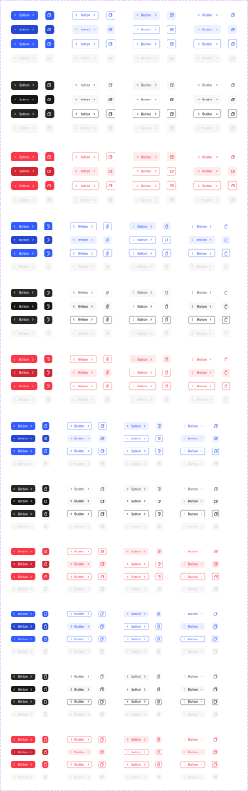

```js
import { Button } from '@/components/ui/button'
```

**API**

| Prop | Values |
|---|---|
| `type` | `primary` `neutral` `error` |
| `style` | `filled` `stroke` `lighter` `ghost` |
| `size` | `medium` `small` `xsmall` `2xsmall` |
| `onlyIcon` | `true` `false` |
| `state` (interaction) | `default` `hover` `focus` `disabled` |

**Anatomy:** 1. Container 2. Label 3. Icon (optional, leading or trailing, or icon-only)

**Tokens used:** `color/primary/base`, `color/static/white`, `color/stroke/soft-200`, `radius/10`, `space/10`, `space/16`, `font/weight/medium`

**Primary filled** — The main action on a view. Use exactly one.

```jsx
<Button type="primary" style="filled">Save changes</Button>
```

```css
.button--primary-filled {
  background: var(--color-primary-base); /* #335cff */
  color: var(--color-static-white); /* #ffffff */
  border-radius: var(--radius-10); /* 10px */
  padding-block: var(--space-10); /* 10px */
  padding-inline: var(--space-16); /* 16px */
  font-weight: var(--font-weight-medium); /* 500 */
}
```

**Neutral stroke** — A supporting action shown alongside primary.

```jsx
<Button type="neutral" style="stroke">Cancel</Button>
```

```css
.button--neutral-stroke {
  background: var(--color-bg-white-0); /* #ffffff */
  color: var(--color-text-sub-600); /* #5c5c5c */
  border-color: var(--color-stroke-soft-200); /* #ebebeb */
  border-radius: var(--radius-10); /* 10px */
}
```

**Ghost** — Low-emphasis action for tertiary or inline use.

```jsx
<Button type="primary" style="ghost">Learn more</Button>
```

```css
.button--ghost {
  background: transparent;
  color: var(--color-primary-base); /* #335cff */
}
```

**Sizes** — Four sizes share one shape: medium 40px, small 36px, x-small 32px, 2x-small 28px.

```jsx
<Button size="small">Small</Button>
<Button size="medium">Medium</Button>
```

```css
.button--sizes {
  /* medium padding: var(--space-10) — 10px */
  /* small padding: var(--space-8) — 8px */
  /* x-small padding: var(--space-6) — 6px */
}
```

**Disabled** — Non-interactive. Keep the label so intent stays clear.

```jsx
<Button type="primary" disabled>Save changes</Button>
```

```css
.button--disabled {
  background: var(--color-bg-weak-50); /* #f7f7f7 */
  color: var(--color-text-disabled-300); /* #d1d1d1 */
  cursor: not-allowed;
}
```

- Do: Use one primary-filled button per view
- Do: Use type="error" only for destructive actions
- Don't: Stack two primary buttons side by side
- Don't: Use a button for navigation, use a Link Button

---

### Compact Button

- status: stable
- category: Actions
- code: **not built yet — do not hand-roll; scaffold it from this spec and mark it code-connected**

Small icon-only button (20/24px) for dense UI: dismiss, expand, inline actions. Optional full-radius.

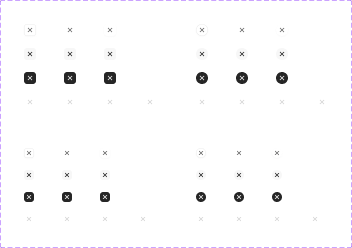

```js
import { CompactButton } from '@/components/ui/compact-button'
```

**API**

| Prop | Values |
|---|---|
| `style` | `stroke` `ghost` `white` `modifiable` |
| `size` | `large-24` `medium-20` |
| `fullRadius` | `true` `false` |
| `state` (interaction) | `default` `hover` `active` `disabled` |

**Anatomy:** 1. Container 2. Icon

**Tokens used:** `color/primary/base`, `color/static/white`, `color/stroke/soft-200`, `color/text/sub-600`, `radius/10`, `space/10`, `space/16`, `font/weight/medium`

- Do: Use inside cards, tags, and list rows where a full Button is too heavy
- Don't: Use for the primary action of a view

---

### Link Button

- status: stable
- category: Actions
- code: **not built yet — do not hand-roll; scaffold it from this spec and mark it code-connected**

Text-styled action for navigation and inline actions, with optional underline.

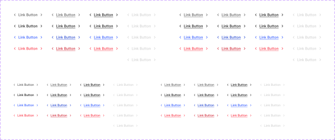

```js
import { LinkButton } from '@/components/ui/link-button'
```

**API**

| Prop | Values |
|---|---|
| `style` | `gray` `black` `primary` `error` `modifiable` |
| `size` | `medium` `small` |
| `underline` | `true` `false` |
| `state` (interaction) | `default` `hover` `focus` `disabled` |

**Anatomy:** 1. Label 2. Icon (optional, leading or trailing)

**Tokens used:** `color/primary/base`, `color/static/white`, `color/stroke/soft-200`, `color/text/sub-600`, `radius/10`, `space/10`, `space/16`, `font/weight/medium`

- Do: Use for navigation and low-emphasis actions
- Don't: Mix link buttons and ghost buttons for the same emphasis level

---

### Social Button

- status: stable
- category: Actions
- code: **not built yet — do not hand-roll; scaffold it from this spec and mark it code-connected**

Third-party auth button (Apple, Google, GitHub, X, Facebook, Dropbox, LinkedIn) in filled or stroke style, full or icon-only.

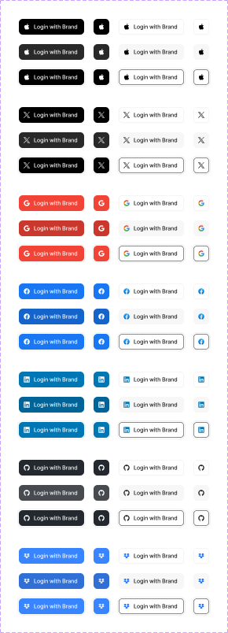

```js
import { SocialButton } from '@/components/ui/social-button'
```

**API**

| Prop | Values |
|---|---|
| `brand` | `apple` `google` `github` `x` `facebook` `dropbox` `linkedin` |
| `style` | `filled` `stroke` |
| `onlyIcon` | `true` `false` |
| `state` (interaction) | `default` `hover` `focus` |

**Anatomy:** 1. Container 2. Brand icon 3. Label (optional)

**Tokens used:** `color/primary/base`, `color/static/white`, `color/stroke/soft-200`, `color/text/sub-600`, `radius/10`, `space/10`, `space/16`, `font/weight/medium`

- Do: Keep every social button the same style on one screen
- Don't: Recolor brand icons — use the official marks

---

### Fancy Button

- status: stable
- category: Actions
- code: **not built yet — do not hand-roll; scaffold it from this spec and mark it code-connected**

Elevated, gradient-edged button for marketing moments and standout CTAs.

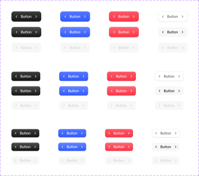

```js
import { FancyButton } from '@/components/ui/fancy-button'
```

**API**

| Prop | Values |
|---|---|
| `type` | `basic` `primary` `neutral` `destructive` |
| `size` | `medium` `small` `xsmall` |
| `state` (interaction) | `default` `hover` `disabled` |

**Anatomy:** 1. Container 2. Label 3. Icon (optional)

**Tokens used:** `color/primary/base`, `color/static/white`, `color/stroke/soft-200`, `color/text/sub-600`, `radius/10`, `space/10`, `space/16`, `font/weight/medium`

- Do: Reserve for one hero action per page
- Don't: Use in dense product UI — use Button

---

### Button Group

- status: stable
- category: Actions
- code: **not built yet — do not hand-roll; scaffold it from this spec and mark it code-connected**

A row of 2–6 connected buttons acting as one control (view switchers, bulk actions). Segments support text, icons, or both.

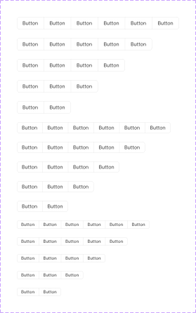

```js
import { ButtonGroup } from '@/components/ui/button-group'
```

**API**

| Prop | Values |
|---|---|
| `quantity` | `2` `3` `4` `5` `6` |
| `size` | `small` `xsmall` `2xsmall` |
| `state` (interaction) | `default` `hover` `active` `disabled` |

**Anatomy:** 1. Group container 2. Button Group Item (per segment: label, optional left/right icon)

**Tokens used:** `color/primary/base`, `color/static/white`, `color/stroke/soft-200`, `color/text/sub-600`, `radius/10`, `space/10`, `space/16`, `font/weight/medium`

- Do: Keep segment labels one word
- Don't: Use for mutually exclusive form choices — use Radio or Segmented Control

---

## Components — Forms

### Text Input

- status: stable
- category: Forms
- code: `src/components/ui/text-input.tsx`

Single-line text field with label and hint text. Types cover the common input formats; siblings Tag Input, Counter Input, and Digit Input share the same state model.

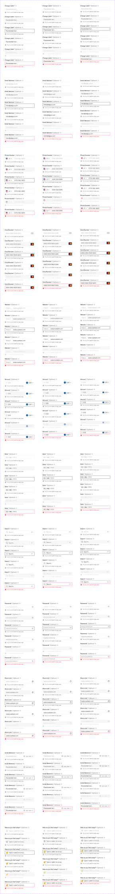

```js
import { TextInput } from '@/components/ui/text-input'
```

**API**

| Prop | Values |
|---|---|
| `type` | `basic` `email` `phone` `card` `website` `amount` `date` `search` `password` `button` `dropdown` `emoji` |
| `size` | `medium` `small` `xsmall` |
| `state` (interaction) | `placeholder` `hover` `focus` `filled` `disabled` `error` |

**Anatomy:** 1. Label (with optional required mark, sublabel, info icon) 2. Field container 3. Leading icon (optional) 4. Placeholder / value 5. Trailing element (optional: icon, button, dropdown) 6. Hint text

**Tokens used:** `color/bg/white-0`, `color/stroke/soft-200`, `color/text/strong-950`, `color/text/soft-400`, `color/state/error/base`, `radius/10`, `space/10`

**Default** — Resting field with a visible label.

```jsx
<TextInput type="email" label="Email" placeholder="you@example.com" />
```

```css
.text-input--default {
  background: var(--color-bg-white-0); /* #ffffff */
  border-color: var(--color-stroke-soft-200); /* #ebebeb */
  color: var(--color-text-strong-950); /* #171717 */
  border-radius: var(--radius-10); /* 10px */
  padding: var(--space-10); /* 10px */
}
```

**Focus** — Focus ring uses the primary token, matching buttons and links.

```jsx
<TextInput label="Email" defaultValue="you@example.com" autoFocus />
```

```css
.text-input--focus {
  outline-color: var(--color-primary-base); /* #335cff */
  outline-width: 2px;
}
```

**Error** — Error state colors the border and hint text by intent.

```jsx
<TextInput label="Email" error="Enter a valid email" />
```

```css
.text-input--error {
  border-color: var(--color-state-error-base); /* #fb3748 */
  color: var(--color-text-strong-950); /* #171717 */
}
```

**Disabled** — Dimmed surface signals the field cannot be edited.

```jsx
<TextInput label="Email" defaultValue="you@example.com" disabled />
```

```css
.text-input--disabled {
  background: var(--color-bg-weak-50); /* #f7f7f7 */
  color: var(--color-text-disabled-300); /* #d1d1d1 */
}
```

- Do: Always pair with a visible label
- Do: Show errors as hint text below the field, colored by state/error
- Don't: Use placeholder text as the only label

---

### Checkbox

- status: stable
- category: Forms
- code: **not built yet — do not hand-roll; scaffold it from this spec and mark it code-connected**

Binary control with indeterminate support. Ships in three layers: bare Checkbox, Checkbox Label (label + description, flippable), and Checkbox Card (selectable card with icon/avatar/logo leading content).

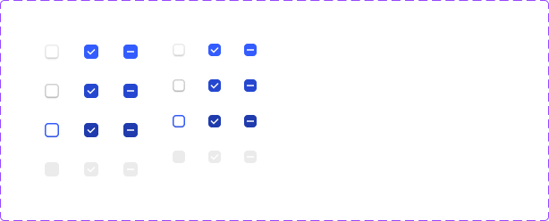

```js
import { Checkbox } from '@/components/ui/checkbox'
```

**API**

| Prop | Values |
|---|---|
| `checked` | `true` `false` `indeterminate` |
| `size` | `medium` `small` |
| `variant` | `bare` `label` `card` |
| `state` (interaction) | `default` `hover` `focused` `disabled` |

**Anatomy:** 1. Box 2. Check / indeterminate indicator 3. Label (optional) 4. Description (optional)

**Tokens used:** `color/primary/base`, `color/stroke/sub-300`, `color/bg/white-0`, `color/static/white`, `radius/6`

- Do: Pair every checkbox with a clickable label
- Don't: Use for mutually exclusive options — use Radio

---

### Radio

- status: stable
- category: Forms
- code: **not built yet — do not hand-roll; scaffold it from this spec and mark it code-connected**

Selects exactly one option. Same three layers as Checkbox: bare Radio, Radio Label, and Radio Card (basic, left icon, avatar, card provider, brand, company).

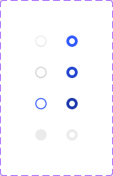

```js
import { Radio } from '@/components/ui/radio'
```

**API**

| Prop | Values |
|---|---|
| `checked` | `true` `false` |
| `variant` | `bare` `label` `card` |
| `state` (interaction) | `default` `hover` `focused` `disabled` |

**Anatomy:** 1. Circle 2. Selected dot 3. Label (optional) 4. Description (optional)

**Tokens used:** `color/primary/base`, `color/stroke/sub-300`, `color/bg/white-0`, `color/static/white`, `radius/full`

- Do: Always show at least two options in a group
- Don't: Use radios when more than one choice can apply

---

### Switch

- status: stable
- category: Forms
- code: **not built yet — do not hand-roll; scaffold it from this spec and mark it code-connected**

Immediate on/off toggle. Layers: bare Switch, Switch Label (description, flip), Switch Card, and Integration Switch (brand logo + description row for settings/integration lists).

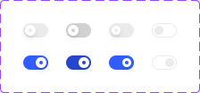

```js
import { Switch } from '@/components/ui/switch'
```

**API**

| Prop | Values |
|---|---|
| `checked` | `true` `false` |
| `variant` | `bare` `label` `card` `integration` |
| `state` (interaction) | `default` `hover` `pressed` `disabled` |

**Anatomy:** 1. Track 2. Thumb 3. Label (optional) 4. Description (optional)

**Tokens used:** `color/primary/base`, `color/bg/soft-200`, `color/static/white`, `radius/full`

- Do: Use for settings that apply instantly
- Don't: Use inside a form that needs a submit step — use Checkbox

---

### Select

- status: stable
- category: Forms
- code: **not built yet — do not hand-roll; scaffold it from this spec and mark it code-connected**

Dropdown-triggering field. Value can carry an icon, flag, avatar, or logo. Compact Select (borderless trigger), Compact Select for Input (embedded in Text Input), and Inline Select are the sibling variants.

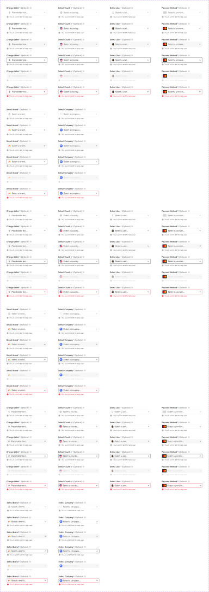

```js
import { Select } from '@/components/ui/select'
```

**API**

| Prop | Values |
|---|---|
| `type` | `basic` `country` `avatar` `provider` `brand` `company` |
| `variant` | `default` `compact` `compact-for-input` `inline` |
| `size` | `medium` `small` `xsmall` |
| `state` (interaction) | `default` `filled` `hover` `focus` `disabled` `error` |

**Anatomy:** 1. Label (optional) 2. Trigger container 3. Leading content (optional) 4. Value 5. Chevron 6. Menu (composed from Dropdown Items)

**Tokens used:** `color/bg/white-0`, `color/stroke/soft-200`, `color/text/strong-950`, `color/text/soft-400`, `color/primary/base`, `color/state/error/base`, `radius/10`, `space/10`

- Do: Use for 5+ options where radios would be too long
- Don't: Use for 2–3 options — prefer Radio or Segmented Control

---

### Text Area

- status: stable
- category: Forms
- code: **not built yet — do not hand-roll; scaffold it from this spec and mark it code-connected**

Multi-line text field with optional label, hint text, and character counter.

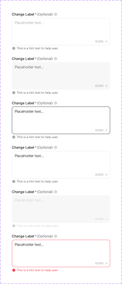

```js
import { TextArea } from '@/components/ui/text-area'
```

**API**

| Prop | Values |
|---|---|
| `counter` | `true` `false` |
| `state` (interaction) | `default` `hover` `focus` `filled` `disabled` `error` |

**Anatomy:** 1. Label (optional) 2. Field container 3. Value 4. Character counter (optional) 5. Hint text (optional)

**Tokens used:** `color/bg/white-0`, `color/stroke/soft-200`, `color/text/strong-950`, `color/text/soft-400`, `color/primary/base`, `color/state/error/base`, `radius/10`, `space/10`

- Do: Give it a sensible default height of 3–4 lines
- Don't: Use for single-line values — use Text Input

---

### Tag Input

- status: stable
- category: Forms
- code: **not built yet — do not hand-roll; scaffold it from this spec and mark it code-connected**

Text field that turns entries into dismissible Tags.

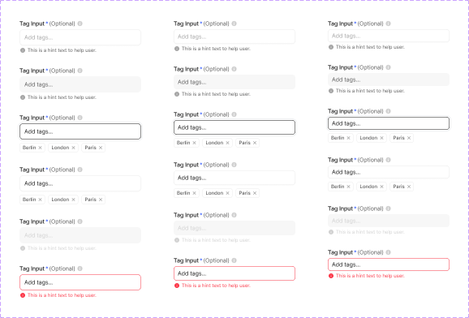

```js
import { TagInput } from '@/components/ui/tag-input'
```

**API**

| Prop | Values |
|---|---|
| `size` | `medium` `small` `xsmall` |
| `state` (interaction) | `default` `hover` `focus` `filled` `disabled` `error` |

**Anatomy:** 1. Label (optional) 2. Field container 3. Tags 4. Input 5. Hint text (optional)

**Tokens used:** `color/bg/white-0`, `color/stroke/soft-200`, `color/text/strong-950`, `color/text/soft-400`, `color/primary/base`, `color/state/error/base`, `radius/10`, `space/10`

- Do: Show remaining-count limits as hint text
- Don't: Use when options come from a fixed list — use a multi-select

---

### Counter Input

- status: stable
- category: Forms
- code: **not built yet — do not hand-roll; scaffold it from this spec and mark it code-connected**

Numeric stepper field with increment/decrement controls.

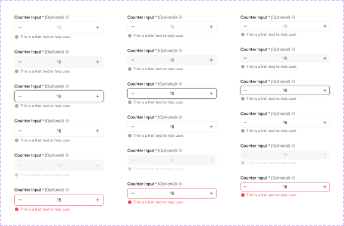

```js
import { CounterInput } from '@/components/ui/counter-input'
```

**API**

| Prop | Values |
|---|---|
| `size` | `medium` `small` `xsmall` |
| `state` (interaction) | `default` `hover` `focus` `filled` `disabled` `error` |

**Anatomy:** 1. Label (optional) 2. Decrement button 3. Value 4. Increment button

**Tokens used:** `color/bg/white-0`, `color/stroke/soft-200`, `color/text/strong-950`, `color/text/soft-400`, `color/primary/base`, `color/state/error/base`, `radius/10`, `space/10`

- Do: Disable the decrement/increment control at min/max
- Don't: Use for large free-range numbers — use a Text Input type=amount

---

### Digit Input

- status: stable
- category: Forms
- code: **not built yet — do not hand-roll; scaffold it from this spec and mark it code-connected**

Fixed-length code entry (OTP / 2FA), one box per digit.

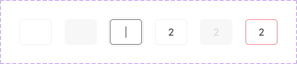

```js
import { DigitInput } from '@/components/ui/digit-input'
```

**API**

| Prop | Values |
|---|---|
| `state` (interaction) | `default` `hover` `focus` `filled` `disabled` `error` |

**Anatomy:** 1. Digit boxes 2. Hint text (optional)

**Tokens used:** `color/bg/white-0`, `color/stroke/soft-200`, `color/text/strong-950`, `color/text/soft-400`, `color/primary/base`, `color/state/error/base`, `radius/10`, `space/10`

- Do: Auto-advance focus as digits are typed
- Don't: Use for anything other than short verification codes

---

### Slider

- status: stable
- category: Forms
- code: **not built yet — do not hand-roll; scaffold it from this spec and mark it code-connected**

Single-value or range slider on a horizontal track, with optional thumb tooltip and label/sublabel.

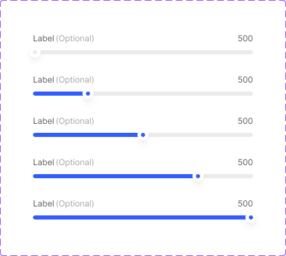

```js
import { Slider } from '@/components/ui/slider'
```

**API**

| Prop | Values |
|---|---|
| `range` | `true` `false` |
| `tooltip` | `true` `false` |
| `state` (interaction) | `default` `hover` `active` `disabled` |

**Anatomy:** 1. Track 2. Filled range 3. Thumb (one or two) 4. Tooltip (optional) 5. Label (optional)

**Tokens used:** `color/bg/white-0`, `color/stroke/soft-200`, `color/text/strong-950`, `color/text/soft-400`, `color/primary/base`, `color/state/error/base`, `radius/10`, `space/10`

- Do: Show the current value (tooltip or label) while dragging
- Don't: Use for precise required values — pair with a Counter Input

---

### Rating

- status: stable
- category: Forms
- code: **not built yet — do not hand-roll; scaffold it from this spec and mark it code-connected**

Star/heart rating plus survey-style rating bars (emoji, number, star, heart scales). Rating & Review adds description and link button layouts.

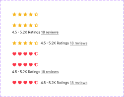

```js
import { Rating } from '@/components/ui/rating'
```

**API**

| Prop | Values |
|---|---|
| `type` | `star` `heart` `emoji` `number` |
| `variant` | `display` `cell` `bar` `review` |
| `state` (interaction) | `default` `hover` `selected` |

**Anatomy:** 1. Rating items (empty / half / full) 2. Value label (optional) 3. Description (optional)

**Tokens used:** `color/bg/white-0`, `color/stroke/soft-200`, `color/text/strong-950`, `color/text/soft-400`, `color/primary/base`, `color/state/error/base`, `radius/10`, `space/10`

- Do: Support half steps in display mode
- Don't: Mix scale types in one flow

---

### Date Picker

- status: stable
- category: Forms
- code: **not built yet — do not hand-roll; scaffold it from this spec and mark it code-connected**

Calendar for single dates or ranges. Composed from Date Selector (month navigation), Day Labels, Day Cells (with marked/disabled/range states), and Period Range presets; footer holds buttons and hint text.

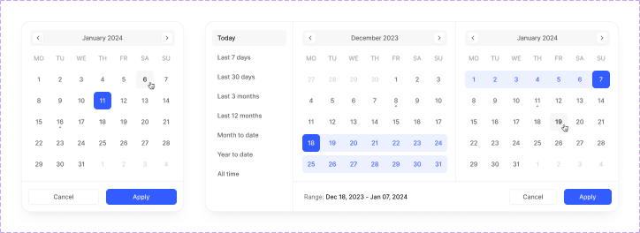

```js
import { DatePicker } from '@/components/ui/date-picker'
```

**API**

| Prop | Values |
|---|---|
| `mode` | `date` `range` |
| `state` (interaction) | `default` `hover` `active` `marked` `disabled` |

**Anatomy:** 1. Date selector (month + arrows) 2. Day labels 3. Day cells grid 4. Period range presets (range mode) 5. Footer (optional buttons)

**Tokens used:** `color/bg/white-0`, `color/stroke/soft-200`, `color/text/strong-950`, `color/text/soft-400`, `color/primary/base`, `color/state/error/base`, `radius/10`, `space/10`

- Do: Disable unavailable days instead of erroring after selection
- Don't: Use a picker for well-known typed dates like birthdays — use Text Input type=date

---

### Time Picker

- status: stable
- category: Forms
- code: **not built yet — do not hand-roll; scaffold it from this spec and mark it code-connected**

Time selection list with optional secondary time (timezone) display, duration selector, and availability status rows. Composed with Select and Scroll parts.

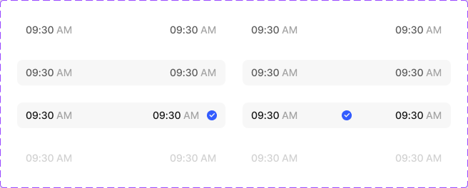

```js
import { TimePicker } from '@/components/ui/time-picker'
```

**API**

| Prop | Values |
|---|---|
| `direction` | `right` `center` |
| `state` (interaction) | `default` `hover` `active` `selected` `disabled` |

**Anatomy:** 1. Time items list 2. Duration selector (optional) 3. Status selector (optional)

**Tokens used:** `color/bg/white-0`, `color/stroke/soft-200`, `color/text/strong-950`, `color/text/soft-400`, `color/primary/base`, `color/state/error/base`, `radius/10`, `space/10`

- Do: Keep the list scrollable with a sensible default position (now, rounded up)
- Don't: Force second-level precision when minutes are enough

---

### File Upload

- status: stable
- category: Forms
- code: **not built yet — do not hand-roll; scaffold it from this spec and mark it code-connected**

Dropzone (File Upload Area), per-file progress cards (in progress / success / error) with format icons, and Image Upload for avatar/logo slots.

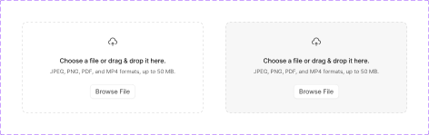

```js
import { FileUpload } from '@/components/ui/file-upload'
```

**API**

| Prop | Values |
|---|---|
| `variant` | `area` `cards` `image-avatar` `image-company` |
| `alignment` | `vertical` `horizontal` |
| `state` (interaction) | `default` `hover` `in-progress` `success` `error` |

**Anatomy:** 1. Upload area (icon, copy, browse button) 2. Upload cards (file name, size, progress, status) 3. Format icon

**Tokens used:** `color/bg/white-0`, `color/stroke/soft-200`, `color/text/strong-950`, `color/text/soft-400`, `color/primary/base`, `color/state/error/base`, `radius/10`, `space/10`

- Do: State accepted formats and max size in the dropzone copy
- Don't: Block the whole form while a file uploads

---

### Color Picker

- status: stable
- category: Forms
- code: **not built yet — do not hand-roll; scaffold it from this spec and mark it code-connected**

Color selection surface: spectrum area, hue/opacity sliders, hex + opacity inputs, and preset Color Dots in the 10-color palette.

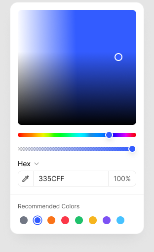

```js
import { ColorPicker } from '@/components/ui/color-picker'
```

**API**

| Prop | Values |
|---|---|
| `presets` | `true` `false` |
| `state` (interaction) | `default` `hover` `selected` `disabled` |

**Anatomy:** 1. Spectrum 2. Hue slider 3. Opacity slider 4. Hex/opacity inputs 5. Preset dots

**Tokens used:** `color/bg/white-0`, `color/stroke/soft-200`, `color/text/strong-950`, `color/text/soft-400`, `color/primary/base`, `color/state/error/base`, `radius/10`, `space/10`

- Do: Offer the token palette as presets first
- Don't: Let product UI pick arbitrary colors that bypass the system

---

### Label & Hint Text

- status: stable
- category: Forms
- code: **not built yet — do not hand-roll; scaffold it from this spec and mark it code-connected**

Shared form furniture: Label (required mark, sublabel, info icon, link button), Hint Text (default / error / disabled), and Password Strength meter (empty / weak / moderate / strong).

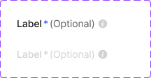

```js
import { LabelHintText } from '@/components/ui/label-hint-text'
```

**API**

| Prop | Values |
|---|---|
| `required` | `true` `false` |
| `state` (interaction) | `default` `error` `disabled` |

**Anatomy:** 1. Label row 2. Hint row (icon + text) 3. Strength bar (password fields)

**Tokens used:** `color/text/strong-950`, `color/text/sub-600`, `color/text/soft-400`, `color/state/error/base`, `type/label/sm`, `type/paragraph/xs`

- Do: Reuse these parts in every field component so spacing stays identical
- Don't: Color hint text manually — the state prop does it

---

### Rich Editor

- status: stable
- category: Forms
- code: **not built yet — do not hand-roll; scaffold it from this spec and mark it code-connected**

Rich-text editing toolbar in four width presets, built from toolbar items (text, dropdown, color, icon) and a 10-color swatch palette.

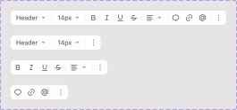

```js
import { RichEditor } from '@/components/ui/rich-editor'
```

**API**

| Prop | Values |
|---|---|
| `preset` | `01` `02` `03` `04` |
| `state` (interaction) | `default` `hover` `active` |

**Anatomy:** 1. Toolbar 2. Toolbar items 3. Color palette dropdown 4. Editing surface

**Tokens used:** `color/bg/white-0`, `color/stroke/soft-200`, `color/text/strong-950`, `color/text/soft-400`, `color/primary/base`, `color/state/error/base`, `radius/10`, `space/10`

- Do: Hide advanced controls behind the Show More toggle
- Don't: Offer colors outside the token palette

---

## Components — Layout

### Widget Box

- status: stable
- category: Layout
- code: `src/components/ui/widget-box.tsx`

Surface that groups related content and actions — the container behind every dashboard widget in the template's Product Components.

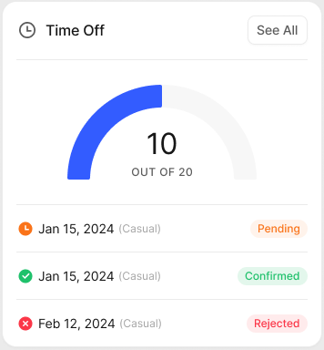

```js
import { WidgetBox } from '@/components/ui/widget-box'
```

**API**

| Prop | Values |
|---|---|
| `elevation` | `flat` `raised` |

**Anatomy:** 1. Surface 2. Header (title + optional action) 3. Body 4. Footer (optional)

**Tokens used:** `color/bg/white-0`, `color/stroke/soft-200`, `radius/16`, `shadow/xs`, `space/16`

**Raised** — Default elevation. Use for standalone surfaces on the canvas.

```jsx
<WidgetBox>
  <WidgetBox.Header title="Weekly report" />
  <WidgetBox.Body>Your team shipped 12 changes this week.</WidgetBox.Body>
  <Button type="neutral" style="stroke" size="small">View</Button>
</WidgetBox>
```

```css
.widget-box--raised {
  background: var(--color-bg-white-0); /* #ffffff */
  border-color: var(--color-stroke-soft-200); /* #ebebeb */
  border-radius: var(--radius-16); /* 16px */
  box-shadow: var(--shadow-xs); /* 0 1px 2px 0 rgba(10,13,20,0.03) */
  padding: var(--space-16); /* 16px */
}
```

**Flat** — No shadow. Use when widgets sit inside another surface.

```jsx
<WidgetBox elevation="flat">…</WidgetBox>
```

```css
.widget-box--flat {
  box-shadow: none;
  border-color: var(--color-stroke-soft-200); /* #ebebeb */
}
```

- Do: Keep one clear primary action per widget
- Don't: Nest widget boxes more than one level deep

---

### Content Divider

- status: stable
- category: Layout
- code: **not built yet — do not hand-roll; scaffold it from this spec and mark it code-connected**

Separator in nine flavors: plain line, spaced line, text, text-and-line, solid text, and icon/text button variants (with grouped-button forms) — used inside dropdowns, tables, and modals.

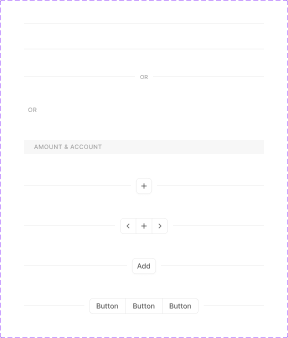

```js
import { ContentDivider } from '@/components/ui/content-divider'
```

**API**

| Prop | Values |
|---|---|
| `type` | `line` `line-spacing` `text-line` `text` `solid-text` `icon-button` `icon-button-group` `text-button` `text-button-group` |

**Anatomy:** 1. Line 2. Text or control (optional)

**Tokens used:** `color/stroke/soft-200`, `color/text/soft-400`, `type/subheading/xs`

- Do: Use the text variants as list section headers
- Don't: Stack dividers without content between them

---

### Scroll

- status: stable
- category: Layout
- code: **not built yet — do not hand-roll; scaffold it from this spec and mark it code-connected**

Custom scrollbar in two visual weights (default, lighter) and three widths (medium 20, small 16, x-small 12).

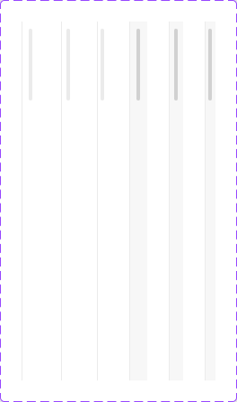

```js
import { Scroll } from '@/components/ui/scroll'
```

**API**

| Prop | Values |
|---|---|
| `style` | `default` `lighter` |
| `size` | `medium` `small` `xsmall` |

**Anatomy:** 1. Track 2. Thumb

**Tokens used:** `color/bg/soft-200`, `radius/full`

- Do: Use the lighter style over content imagery
- Don't: Hide scrollbars on long lists entirely

---

## Components — Navigation

### Breadcrumbs

- status: stable
- category: Navigation
- code: **not built yet — do not hand-roll; scaffold it from this spec and mark it code-connected**

Hierarchy trail of 3–5 items with arrow, slash, or dot dividers. Items can be icon-only, text-only, or both.

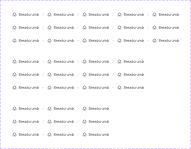

```js
import { Breadcrumbs } from '@/components/ui/breadcrumbs'
```

**API**

| Prop | Values |
|---|---|
| `divider` | `arrow` `slash` `dot` |
| `quantity` | `3` `4` `5` |
| `state` (interaction) | `default` `hover` `active` |

**Anatomy:** 1. Item (icon and/or text) 2. Divider 3. Current page

**Tokens used:** `color/bg/weak-50`, `color/text/sub-600`, `color/text/strong-950`, `color/primary/base`, `color/stroke/soft-200`, `radius/8`

- Do: Mark the current page as non-clickable
- Don't: Use breadcrumbs on flat, single-level sites

---

### Pagination

- status: stable
- category: Navigation
- code: **not built yet — do not hand-roll; scaffold it from this spec and mark it code-connected**

Page cells composed into a Pagination Group (basic, full-radius, or grouped style) with first/last and next/previous toggles plus optional totals info.

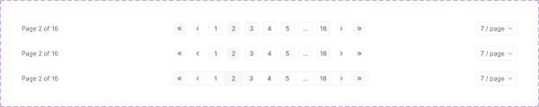

```js
import { Pagination } from '@/components/ui/pagination'
```

**API**

| Prop | Values |
|---|---|
| `style` | `basic` `full-radius` `group` |
| `state` (interaction) | `default` `hover` `selected` `disabled` |

**Anatomy:** 1. Previous / first controls 2. Page cells 3. Ellipsis 4. Next / last controls 5. Totals info (optional)

**Tokens used:** `color/bg/weak-50`, `color/text/sub-600`, `color/text/strong-950`, `color/primary/base`, `color/stroke/soft-200`, `radius/8`

- Do: Disable prev/next at the ends of the range
- Don't: Use pagination for infinite feeds — use load-more

---

### Tab Menu

- status: stable
- category: Navigation
- code: **not built yet — do not hand-roll; scaffold it from this spec and mark it code-connected**

Horizontal (2–6 tabs) or vertical (2–8, card or list style) tab navigation. Items support icons and count badges.

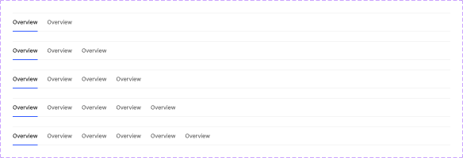

```js
import { TabMenu } from '@/components/ui/tab-menu'
```

**API**

| Prop | Values |
|---|---|
| `orientation` | `horizontal` `vertical` |
| `style` | `default` `card` `list` |
| `state` (interaction) | `default` `hover` `active` |

**Anatomy:** 1. Tab list 2. Tab item (label, optional icon, optional badge) 3. Active indicator

**Tokens used:** `color/bg/weak-50`, `color/text/sub-600`, `color/text/strong-950`, `color/primary/base`, `color/stroke/soft-200`, `radius/8`

- Do: Keep tab labels to one or two words
- Don't: Use tabs for a sequential flow — use Step Indicator

---

### Segmented Control

- status: stable
- category: Navigation
- code: **not built yet — do not hand-roll; scaffold it from this spec and mark it code-connected**

Pill-style switcher of 2–3 options with optional label; items can carry a left icon or be icon-only.

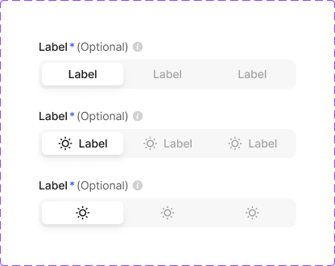

```js
import { SegmentedControl } from '@/components/ui/segmented-control'
```

**API**

| Prop | Values |
|---|---|
| `itemType` | `default` `left-icon` `only-icon` |
| `state` (interaction) | `default` `hover` `active` `disabled` |

**Anatomy:** 1. Container 2. Item (label and/or icon) 3. Active pill

**Tokens used:** `color/bg/weak-50`, `color/bg/white-0`, `color/text/sub-600`, `color/text/strong-950`, `radius/8`, `shadow/xs`

- Do: Use for instant view switches (list/grid, monthly/yearly)
- Don't: Exceed three segments — use Tab Menu

---

### Step Indicator

- status: stable
- category: Navigation
- code: **not built yet — do not hand-roll; scaffold it from this spec and mark it code-connected**

Multi-step progress in horizontal or vertical orientation (3–5 steps), plus a full sidebar variant and compact Stepper Dots.

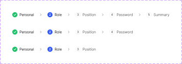

```js
import { StepIndicator } from '@/components/ui/step-indicator'
```

**API**

| Prop | Values |
|---|---|
| `orientation` | `horizontal` `vertical` `sidebar` `dots` |
| `quantity` | `3` `4` `5` |
| `state` (interaction) | `default` `active` `completed` |

**Anatomy:** 1. Step item (number/check, label) 2. Connector 3. Active / completed markers

**Tokens used:** `color/bg/weak-50`, `color/text/sub-600`, `color/text/strong-950`, `color/primary/base`, `color/stroke/soft-200`, `radius/8`

- Do: Mark completed steps as clickable to go back
- Don't: Use for fewer than three steps

---

## Components — Feedback

### Alert

- status: stable
- category: Feedback
- code: **not built yet — do not hand-roll; scaffold it from this spec and mark it code-connected**

One component covers Alert, Notification, and Toast: five statuses (error, warning, success, information, feature) × four styles (filled, light, lighter, stroke) × three sizes, with optional description, link buttons, and dismiss.

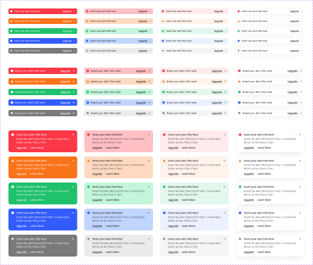

```js
import { Alert } from '@/components/ui/alert'
```

**API**

| Prop | Values |
|---|---|
| `status` | `error` `warning` `success` `information` `feature` |
| `style` | `filled` `light` `lighter` `stroke` |
| `size` | `xsmall` `small` `large` |
| `state` (interaction) | `default` `dismissible` |

**Anatomy:** 1. Container 2. Status icon 3. Title 4. Description (optional) 5. Link buttons (optional) 6. Dismiss (optional)

**Tokens used:** `color/state/error/lighter`, `color/state/error/base`, `color/state/error/dark`, `radius/12`, `space/12`, `font/weight/medium`

- Do: Pick status by intent and let the state tokens color it
- Don't: Put critical, must-read content in an auto-dismissing toast

---

### Banner

- status: stable
- category: Feedback
- code: **not built yet — do not hand-roll; scaffold it from this spec and mark it code-connected**

Full-width top-of-screen announcement using the same status × style matrix as Alert, with optional description, link button, and dismiss.

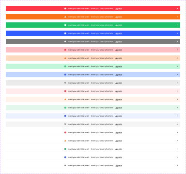

```js
import { Banner } from '@/components/ui/banner'
```

**API**

| Prop | Values |
|---|---|
| `status` | `error` `warning` `success` `information` `feature` |
| `style` | `filled` `light` `lighter` `stroke` |
| `state` (interaction) | `default` `dismissible` |

**Anatomy:** 1. Container 2. Status icon 3. Message 4. Link button (optional) 5. Dismiss (optional)

**Tokens used:** `color/state/information/lighter`, `color/state/information/base`, `color/state/information/dark`, `space/12`

- Do: Show at most one banner at a time
- Don't: Use for per-field errors — use Hint Text

---

### Progress Bar

- status: stable
- category: Feedback
- code: **not built yet — do not hand-roll; scaffold it from this spec and mark it code-connected**

Linear bar (0–100% in 10% steps) with label layouts (top/right, optional bottom caption) and a Circular variant (48–80px, optional center number). Bar color communicates status.

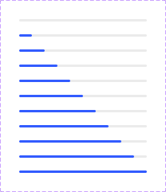

```js
import { ProgressBar } from '@/components/ui/progress-bar'
```

**API**

| Prop | Values |
|---|---|
| `shape` | `linear` `circular` |
| `color` | `blue` `red` `orange` `green` |
| `state` (interaction) | `empty` `in-progress` `complete` |

**Anatomy:** 1. Track 2. Filled line 3. Label (optional) 4. Caption (optional)

**Tokens used:** `color/primary/base`, `color/bg/soft-200`, `color/state/success/base`, `color/state/error/base`, `radius/full`

- Do: Use a determinate bar whenever progress is knowable
- Don't: Animate to 90% and stall — show real progress

---

### Tooltip

- status: stable
- category: Feedback
- code: **not built yet — do not hand-roll; scaffold it from this spec and mark it code-connected**

Hover/focus hint with 8 tail placements and three sizes; Large adds a description, icon, and dismiss. Tail can be hidden; dark and light modes built in.

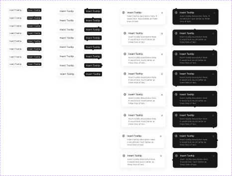

```js
import { Tooltip } from '@/components/ui/tooltip'
```

**API**

| Prop | Values |
|---|---|
| `placement` | `top-left` `top-center` `top-right` `bottom-left` `bottom-center` `bottom-right` `left` `right` |
| `size` | `2xsmall` `xsmall` `large` |
| `state` (interaction) | `hidden` `visible` |

**Anatomy:** 1. Bubble 2. Tail (optional) 3. Title 4. Description (large only)

**Tokens used:** `color/bg/strong-950`, `color/text/white-0`, `radius/6`, `space/8`

- Do: Keep tooltips to a short phrase
- Don't: Put essential information only in a tooltip

---

## Components — Data display

### Badge

- status: beta
- category: Data display
- code: `src/components/ui/badge.tsx`

Small status or count indicator. Four styles (filled, light, lighter, stroke) across the 10-color palette; Status Badge is the semantic sibling (completed, pending, failed).

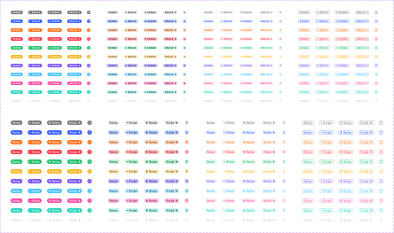

```js
import { Badge } from '@/components/ui/badge'
```

**API**

| Prop | Values |
|---|---|
| `type` | `basic` `with-dot` `left-icon` `right-icon` |
| `style` | `filled` `light` `lighter` `stroke` |
| `color` | `gray` `blue` `orange` `red` `green` `yellow` `purple` `sky` `pink` `teal` |
| `size` | `small` `medium` |
| `state` (interaction) | `default` `disabled` |

**Anatomy:** 1. Container 2. Dot or icon (optional) 3. Value

**Tokens used:** `color/state/faded/lighter`, `color/state/faded/dark`, `color/primary/base`, `color/static/white`, `radius/full`, `space/8`

**Filled** — Strongest emphasis. Use for counts and unread states.

```jsx
<Badge style="filled" color="blue">3</Badge>
```

```css
.badge--filled {
  background: var(--color-primary-base); /* #335cff */
  color: var(--color-static-white); /* #ffffff */
  border-radius: var(--radius-full); /* 999px */
  padding-inline: var(--space-8); /* 8px */
}
```

**Lighter** — Quiet tinted label for status that should not pull focus.

```jsx
<Badge style="lighter" color="gray">New</Badge>
```

```css
.badge--lighter {
  background: var(--color-state-faded-lighter); /* #f5f5f5 */
  color: var(--color-state-faded-dark); /* #171717 */
}
```

- Do: Pick the color by intent (state tokens), not decoration
- Don't: Put sentences inside a badge

---

### Tag

- status: planned
- category: Data display
- code: **not built yet — do not hand-roll; scaffold it from this spec and mark it code-connected**

Removable label for categorizing items. Leading content can be an icon, avatar, flag, or logo; dismiss icon is a toggle.

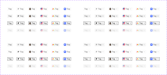

```js
import { Tag } from '@/components/ui/tag'
```

**API**

| Prop | Values |
|---|---|
| `type` | `basic` `left-icon` `avatar` `country` `brand` `company` |
| `style` | `stroke` `gray` |
| `dismissible` | `true` `false` |
| `state` (interaction) | `default` `hover` `active` `disabled` |

**Anatomy:** 1. Container 2. Leading content (optional: icon, avatar, flag, logo) 3. Label 4. Dismiss icon (optional)

**Tokens used:** `color/bg/white-0`, `color/bg/weak-50`, `color/stroke/soft-200`, `color/text/sub-600`, `radius/6`, `space/4`

**Stroke, dismissible** — Carries a remove control for dismissing the selection.

```jsx
<Tag style="stroke" onDismiss={...}>Design</Tag>
```

```css
.tag--stroke-dismissible {
  background: var(--color-bg-white-0); /* #ffffff */
  border-color: var(--color-stroke-soft-200); /* #ebebeb */
  color: var(--color-text-sub-600); /* #5c5c5c */
  border-radius: var(--radius-6); /* 6px */
  gap: var(--space-4); /* 4px */
}
```

**Gray, read-only** — No remove control. Use for fixed categories.

```jsx
<Tag style="gray">Design</Tag>
```

```css
.tag--gray-read-only {
  background: var(--color-bg-weak-50); /* #f7f7f7 */
  padding-inline: var(--space-8); /* 8px */
  padding-block: var(--space-4); /* 4px */
}
```

- Do: Group tags on one row where possible
- Don't: Use tags for actions, they read as passive labels

---

### Avatar

- status: stable
- category: Data display
- code: **not built yet — do not hand-roll; scaffold it from this spec and mark it code-connected**

User/entity representation in 9 sizes (20–80px) with image, initials, icon, memoji, or illustration content; bottom status (online, offline, busy, away, company) and top status (verified, pin, favorite, add, remove, notification) indicators; Avatar Group and Compact Avatar Group for collections.

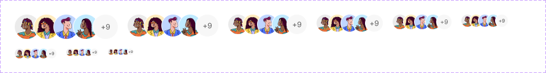

```js
import { Avatar } from '@/components/ui/avatar'
```

**API**

| Prop | Values |
|---|---|
| `size` | `20` `24` `32` `40` `48` `56` `64` `72` `80` |
| `content` | `image` `initials` `icon` |
| `group` | `none` `group` `compact-group` |

**Anatomy:** 1. Container 2. Image / initials / icon 3. Bottom status (optional) 4. Top status (optional)

**Tokens used:** `color/bg/weak-50`, `color/text/sub-600`, `radius/full`, `color/state/success/base`

- Do: Provide a text alternative for the image
- Don't: Rely on the status dot color alone to convey state

---

### Status Badge

- status: stable
- category: Data display
- code: **not built yet — do not hand-roll; scaffold it from this spec and mark it code-connected**

Semantic sibling of Badge for workflow states: completed, pending, failed, information, disabled — in light or stroke style, with optional dot.

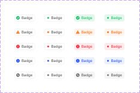

```js
import { StatusBadge } from '@/components/ui/status-badge'
```

**API**

| Prop | Values |
|---|---|
| `status` | `completed` `pending` `failed` `information` `disabled` |
| `style` | `light` `stroke` |
| `withDot` | `true` `false` |

**Anatomy:** 1. Container 2. Dot or icon (optional) 3. Label

**Tokens used:** `color/state/success/lighter`, `color/state/success/base`, `color/state/warning/base`, `color/state/error/base`, `radius/full`, `space/8`

- Do: Use in tables and lists where states repeat
- Don't: Invent new status colors — these five map to the state tokens

---

### Table

- status: stable
- category: Data display
- code: **not built yet — do not hand-roll; scaffold it from this spec and mark it code-connected**

Tables compose from Table Header Cell (with Sorting Icons) and Table Row Cell — no monolithic component. Row cells set text priority (leading, regular, passive) and can embed Button, Button Group, Switch, Rating, Progress Bar, Status Badge, Badge Group, or Avatar Group.

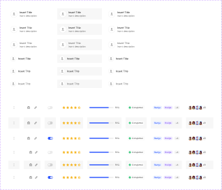

```js
import { Table } from '@/components/ui/table'
```

**API**

| Prop | Values |
|---|---|
| `rowSize` | `large-48` `xlarge-64` |
| `priority` | `leading` `regular` `passive` `none` |
| `state` (interaction) | `default` `hover` `active` |

**Anatomy:** 1. Header cell (label, sort icon) 2. Row cell (content by priority) 3. Embedded component (optional) 4. Pagination (optional, below)

**Tokens used:** `color/bg/white-0`, `color/stroke/soft-200`, `color/text/strong-950`, `color/text/sub-600`, `radius/8`, `space/12`

- Do: Left-align text, right-align numbers, one leading column per row
- Don't: Embed more than two interactive components per row

---

### Accordion

- status: stable
- category: Data display
- code: **not built yet — do not hand-roll; scaffold it from this spec and mark it code-connected**

Expandable disclosure row with optional left icon and a flippable chevron position.

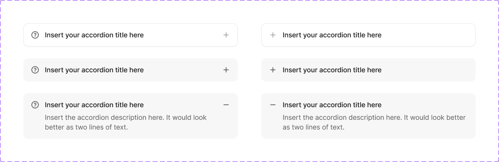

```js
import { Accordion } from '@/components/ui/accordion'
```

**API**

| Prop | Values |
|---|---|
| `flipIcon` | `true` `false` |
| `state` (interaction) | `default` `hover` `active` |

**Anatomy:** 1. Header (title, optional icon) 2. Chevron 3. Content panel

**Tokens used:** `color/bg/white-0`, `color/stroke/soft-200`, `color/text/strong-950`, `color/text/sub-600`, `radius/8`, `space/12`

- Do: Allow multiple items open unless space demands otherwise
- Don't: Hide critical content behind an accordion by default

---

### Activity Feed

- status: stable
- category: Data display
- code: **not built yet — do not hand-roll; scaffold it from this spec and mark it code-connected**

Chronological event list with typed rows: default, file attachment, comment, avatar group, and task status (success, warning, pending, error), plus filter chips.

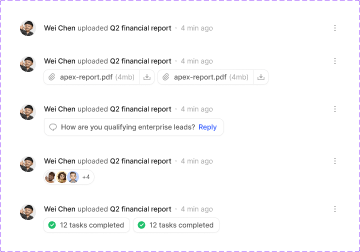

```js
import { ActivityFeed } from '@/components/ui/activity-feed'
```

**API**

| Prop | Values |
|---|---|
| `type` | `default` `file` `comment` `avatar-group` `tasks` |
| `state` (interaction) | `default` `hover` |

**Anatomy:** 1. Feed item (avatar/icon, text, timestamp) 2. Attachment / comment / task row (per type) 3. Filter chips (optional)

**Tokens used:** `color/bg/white-0`, `color/stroke/soft-200`, `color/text/strong-950`, `color/text/sub-600`, `radius/8`, `space/12`

- Do: Group items by day when the feed spans days
- Don't: Mix relative and absolute timestamps in one feed

---

### Notification Feed

- status: stable
- category: Data display
- code: **not built yet — do not hand-roll; scaffold it from this spec and mark it code-connected**

Notification panel composed of header, tab menu (2–4 tabs), typed items (basic, button, file, message) separated by content dividers, and a footer with shortcut links.

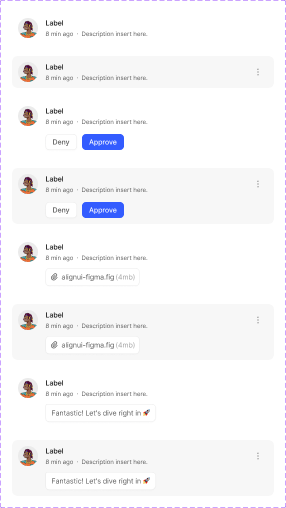

```js
import { NotificationFeed } from '@/components/ui/notification-feed'
```

**API**

| Prop | Values |
|---|---|
| `itemType` | `basic` `button` `file` `message` |
| `tabs` | `2` `3` `4` |
| `state` (interaction) | `default` `hover` |

**Anatomy:** 1. Header (title, actions) 2. Tab menu 3. Notification items 4. Footer

**Tokens used:** `color/bg/white-0`, `color/stroke/soft-200`, `color/text/strong-950`, `color/text/sub-600`, `radius/8`, `space/12`

- Do: Offer mark-all-read in the header
- Don't: Auto-dismiss unread notifications

---

## Components — Overlays

### Modal

- status: stable
- category: Overlays
- code: **not built yet — do not hand-roll; scaffold it from this spec and mark it code-connected**

Composed surface: Modal Header (basic, left icon, or status: error/warning/success/information; 56/80px) + free content + Modal Footer (basic, checkbox, toggle, stepper, link button, stretch) over the Modal Overlay scrim. Status Modals are ready-made confirmations.

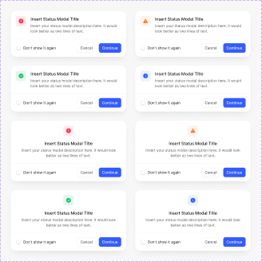

```js
import { Modal } from '@/components/ui/modal'
```

**API**

| Prop | Values |
|---|---|
| `headerType` | `basic` `left-icon` `error` `warning` `success` `information` |
| `headerSize` | `medium-80` `small-56` |
| `footerType` | `basic` `checkbox` `toggle` `stepper` `link-button` `stretch` |
| `state` (interaction) | `closed` `open` |

**Anatomy:** 1. Overlay 2. Header (title, optional description or status icon, close) 3. Body 4. Footer (actions)

**Tokens used:** `color/bg/white-0`, `color/stroke/soft-200`, `shadow/md`, `radius/16`, `space/16`, `color/text/strong-950`

- Do: Return focus to the trigger on close
- Don't: Stack modals on top of each other

---

### Drawer

- status: stable
- category: Overlays
- code: **not built yet — do not hand-roll; scaffold it from this spec and mark it code-connected**

Side panel composed from Drawer Header (basic or left icon; small/large) + free content + Drawer Footer (basic, checkbox, toggle, stepper, link button, stretch).

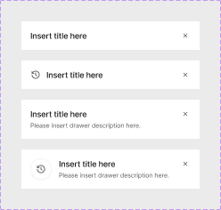

```js
import { Drawer } from '@/components/ui/drawer'
```

**API**

| Prop | Values |
|---|---|
| `headerType` | `basic` `left-icon` |
| `footerType` | `basic` `checkbox` `toggle` `stepper` `link-button` `stretch` |
| `state` (interaction) | `closed` `open` |

**Anatomy:** 1. Overlay 2. Panel 3. Header 4. Body 5. Footer

**Tokens used:** `color/bg/white-0`, `color/stroke/soft-200`, `shadow/md`, `radius/16`, `space/16`, `color/text/strong-950`

- Do: Use for detail views and multi-field editing that keeps page context
- Don't: Use a drawer for a blocking confirmation — use a Modal

---

### Popover

- status: stable
- category: Overlays
- code: **not built yet — do not hand-roll; scaffold it from this spec and mark it code-connected**

Anchored floating panel with 12 tail placements (tail hideable) and an optional footer (stretch buttons or stepper) for multi-step hints and tours.

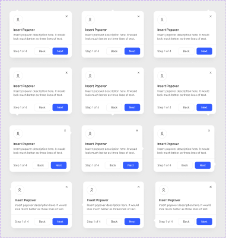

```js
import { Popover } from '@/components/ui/popover'
```

**API**

| Prop | Values |
|---|---|
| `placement` | `top-left` `top-center` `top-right` `bottom-left` `bottom-center` `bottom-right` `right-top` `right` `right-bottom` `left-top` `left` `left-bottom` |
| `footer` | `none` `stretch` `stepper` `text-stepper` |
| `state` (interaction) | `hidden` `visible` |

**Anatomy:** 1. Panel 2. Tail 3. Title 4. Body 5. Footer (optional)

**Tokens used:** `color/bg/white-0`, `color/stroke/soft-200`, `shadow/md`, `radius/16`, `space/16`, `color/text/strong-950`

- Do: Use the stepper footer for product tours
- Don't: Use a popover for destructive confirmations — use a Modal

---

### Dropdown

- status: stable
- category: Overlays
- code: **not built yet — do not hand-roll; scaffold it from this spec and mark it code-connected**

Menu items for selects, context menus, and command surfaces. Items (small 36 / large 56) carry avatars, flags, or logos plus optional checkbox, sublabel, badge, shortcut, toggle, or button; misc items add search, buttons, and captions. The container is a 16px-radius surface with the md shadow, assembled per use.

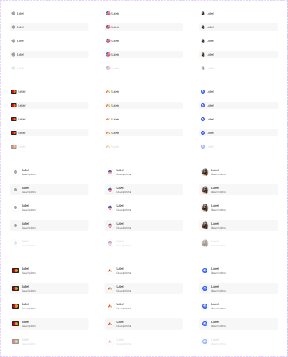

```js
import { Dropdown } from '@/components/ui/dropdown'
```

**API**

| Prop | Values |
|---|---|
| `itemType` | `basic` `country` `avatar` `provider` `brand` `company` |
| `size` | `small-36` `large-56` |
| `state` (interaction) | `default` `hover` `selected` `disabled` |

**Anatomy:** 1. Container (assembled) 2. Item (leading content, label, trailing content) 3. Misc item (search / button / caption) 4. Content divider

**Tokens used:** `color/bg/white-0`, `color/stroke/soft-200`, `shadow/md`, `radius/16`, `space/16`, `color/text/strong-950`

- Do: Keep one interaction pattern per menu (select or command, not both)
- Don't: Exceed ~8 visible items without search

---

### Command Menu

- status: stable
- category: Overlays
- code: **not built yet — do not hand-roll; scaffold it from this spec and mark it code-connected**

⌘K palette composed from a search input, typed result items (basic, avatar, left icon, brand, company, country; 48/64px), and a shortcut footer.

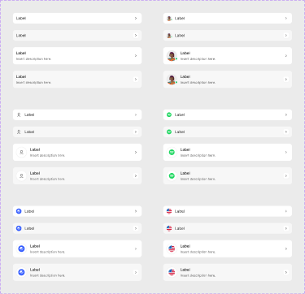

```js
import { CommandMenu } from '@/components/ui/command-menu'
```

**API**

| Prop | Values |
|---|---|
| `itemSize` | `small-48` `medium-64` |
| `state` (interaction) | `default` `hover` |

**Anatomy:** 1. Search input 2. Result items 3. Footer (shortcut hints)

**Tokens used:** `color/bg/white-0`, `color/stroke/soft-200`, `shadow/md`, `radius/16`, `space/16`, `color/text/strong-950`

- Do: Order results by recency and match quality
- Don't: Bury primary navigation exclusively in the command menu

---

## Components — Product

### Sidebar

- status: stable
- category: Product
- code: **not built yet — do not hand-roll; scaffold it from this spec and mark it code-connected**

App navigation panel with collapsed mode, composed from Sidebar Header, Header Card, Sidebar Items, Feature Cards (six types × four styles), User Profile Card, and Sidebar Footer.

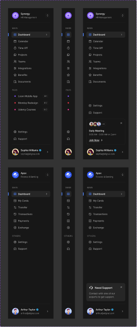

```js
import { Sidebar } from '@/components/ui/sidebar'
```

**API**

| Prop | Values |
|---|---|
| `collapsed` | `true` `false` |
| `featureCard` | `true` `false` |
| `state` (interaction) | `default` `hover` `active` |

**Anatomy:** 1. Header (logo / workspace card) 2. Nav items (icon, label, badge) 3. Feature card (optional) 4. User profile card 5. Footer

**Tokens used:** `color/bg/white-0`, `color/bg/weak-50`, `color/stroke/soft-200`, `color/text/sub-600`, `color/text/strong-950`, `space/16`, `radius/16`

- Do: Persist the collapsed state per user
- Don't: Nest navigation more than two levels deep

---

### Topbar

- status: stable
- category: Product
- code: **not built yet — do not hand-roll; scaffold it from this spec and mark it code-connected**

Top app bar with page context and actions, composed from Topbar Items, Item Buttons, and User Profile.

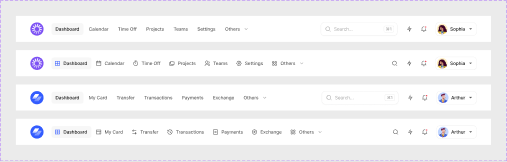

```js
import { Topbar } from '@/components/ui/topbar'
```

**API**

| Prop | Values |
|---|---|
| `type` | `default` `with-icon` |
| `state` (interaction) | `default` `hover` `active` |

**Anatomy:** 1. Page title / context 2. Search (optional) 3. Action buttons 4. User profile

**Tokens used:** `color/bg/white-0`, `color/bg/weak-50`, `color/stroke/soft-200`, `color/text/sub-600`, `color/text/strong-950`, `space/16`, `radius/16`

- Do: Keep global actions (search, notifications) consistent across pages
- Don't: Duplicate the sidebar's navigation in the topbar

---

### Page Header

- status: stable
- category: Product
- code: **not built yet — do not hand-roll; scaffold it from this spec and mark it code-connected**

Page-level (88px) and section-level (80px) headers in five types: basic, avatar, left icon, brand, company — title, description, and action slot.


```js
import { PageHeader } from '@/components/ui/page-header'
```

**API**

| Prop | Values |
|---|---|
| `level` | `page` `section` |
| `type` | `basic` `avatar` `left-icon` `brand` `company` |

**Anatomy:** 1. Leading content (optional) 2. Title 3. Description (optional) 4. Actions

**Tokens used:** `color/bg/white-0`, `color/bg/weak-50`, `color/stroke/soft-200`, `color/text/sub-600`, `color/text/strong-950`, `space/16`, `radius/16`

- Do: Use one page header per view; section headers below it
- Don't: Put more than two actions in the header — overflow the rest

---

### Empty State

- status: stable
- category: Product
- code: **not built yet — do not hand-roll; scaffold it from this spec and mark it code-connected**

Illustrated placeholder shown when a widget or view has no data: illustration tile, message, and optional action.


```js
import { EmptyState } from '@/components/ui/empty-state'
```

**Anatomy:** 1. Illustration 2. Message 3. Action (optional)

**Tokens used:** `color/bg/weak-50`, `color/text/sub-600`, `color/text/soft-400`, `space/16`

- Do: Say what will appear here and how to create it
- Don't: Show a bare 'No data' string inside a widget

---

## Changing the system

- Figma variables are the single source of truth. Change flows one way: Figma → `tokens/figma.raw.json` → build → code/docs.
- To change a value (color, radius, spacing): edit the Figma variable (or ask the design-system skill to "propagate" the change), re-pull, and rebuild. Never patch generated files.
- To add a component: add it to Figma and the inventory (or promote a planned template), then rebuild.
- Lint for drift: `node design-system/scripts/lint.mjs` (Figma screens) and `node design-system/scripts/lint.mjs --code src/` (your source code).
